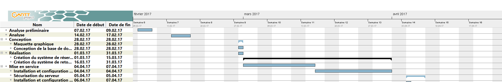
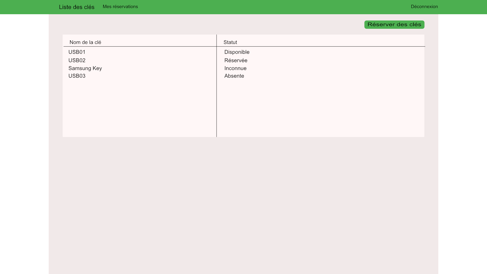
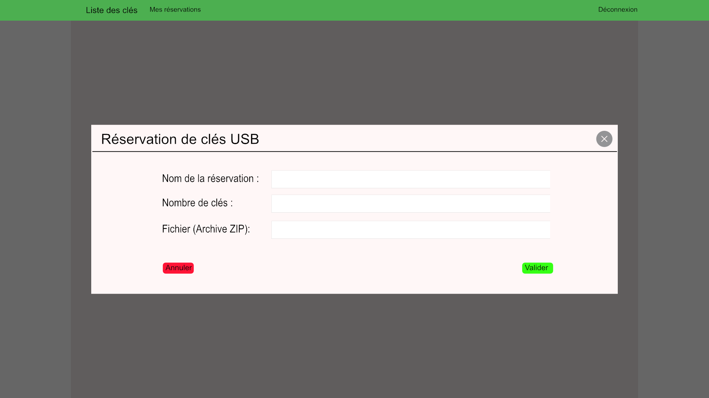

# Projet Rack à Clés
> Created by Jonathan Debétaz

<!-- TOC -->

- [Projet Rack à Clés](#projet-rack-cl-s)
    - [1. Analyse préliminaire](#1-analyse-pr-liminaire)
        - [1.1 Introduction](#1-1-introduction)
        - [1.2 Organisation](#1-2-organisation)
        - [1.3 Objectifs](#1-3-objectifs)
            - [Use case 1: Le secrétariat gère le stock de clés](#use-case-1-le-secr-tariat-g-re-le-stock-de-cl-s)
                - [Scénario: Consultation du stock](#sc-nario-consultation-du-stock)
                - [Scénario: Elimination du stock](#sc-nario-elimination-du-stock)
                - [Scénario: Ajout au stock](#sc-nario-ajout-au-stock)
            - [Use case 2: Un enseignant utilise des clés](#use-case-2-un-enseignant-utilise-des-cl-s)
                - [Scénario: Réservation](#sc-nario-r-servation)
                - [Scénario: Libération](#sc-nario-lib-ration)
        - [1.4 Planification initiale](#1-4-planification-initiale)
    - [2. Analyse](#2-analyse)
        - [2.1 Cahier des charges détaillé](#2-1-cahier-des-charges-d-taill)
            - [2.1.1 Définition du contenu et des fonctionnalités](#2-1-1-d-finition-du-contenu-et-des-fonctionnalit-s)
            - [2.1.2 Analyse concurentielle](#2-1-2-analyse-concurentielle)
            - [2.1.3 Architecture de l'application](#2-1-3-architecture-de-l-application)
            - [2.1.4 Maquette préliminaire](#2-1-4-maquette-pr-liminaire)
            - [2.1.5 Nom du site et nom de domaine](#2-1-5-nom-du-site-et-nom-de-domaine)
            - [2.1.6 Référencement](#2-1-6-r-f-rencement)
            - [2.1.7 Définition de l'audiance](#2-1-7-d-finition-de-l-audiance)
            - [2.1.8 Définition des intervenant](#2-1-8-d-finition-des-intervenant)
        - [2.2 Stratégie de tests](#2-2-strat-gie-de-tests)
        - [2.3 Budget initial](#2-3-budget-initial)
        - [2.4 Planification](#2-4-planification)
        - [2.5 Historique](#2-5-historique)
    - [3. Conception](#3-conception)
        - [3.1 Analyse de l'environnement](#3-1-analyse-de-l-environnement)
        - [3.2 Détermination de l'arborescence du site et des rubriques](#3-2-d-termination-de-l-arborescence-du-site-et-des-rubriques)
        - [3.3 Définition de la charte graphique](#3-3-d-finition-de-la-charte-graphique)
        - [3.4 Maquette graphique](#3-4-maquette-graphique)
        - [3.5 Conception de la base de donnée](#3-5-conception-de-la-base-de-donn-e)
        - [3.6 Conception du code](#3-6-conception-du-code)
        - [3.7 Plugins](#3-7-plugins)
        - [3.8 Choix de la formule d'hébergement](#3-8-choix-de-la-formule-d-h-bergement)
    - [4. Réalisation](#4-r-alisation)
        - [4.1 Dossier de réalisation](#4-1-dossier-de-r-alisation)
        - [4.2 Description des tests effectués](#4-2-description-des-tests-effectu-s)
        - [4.3 Erreurs restantes](#4-3-erreurs-restantes)
        - [4.4 Dossier d'archivage](#4-4-dossier-d-archivage)
    - [5. Mise en service](#5-mise-en-service)
        - [5.1 Rapport de la mise en service](#5-1-rapport-de-la-mise-en-service)
        - [5.2 Liste des documents fournis](#5-2-liste-des-documents-fournis)
    - [6. Conclusions](#6-conclusions)
    - [7. Annexes](#7-annexes)
        - [7.1 Sources - Bibliographie](#7-1-sources-bibliographie)
        - [7.2 Journal de bord de chaque participant](#7-2-journal-de-bord-de-chaque-participant)
        - [7.3 Manuel d'installation](#7-3-manuel-d-installation)
        - [7.4 Manuel d'utilisation](#7-4-manuel-d-utilisation)
        - [7.5 Archive du projet](#7-5-archive-du-projet)

<!-- /TOC -->

## 1. Analyse préliminaire
### 1.1 Introduction
Durant les semaine d'examens, les enseignants de la filière informtique du CPNV utilisent fréquemment des clés USB pour distribuer des données nécessaires à l'examen et/ou pour collecter le travail effectué par les élèves. Cela donne lieu à passablement de manipulations dont on aimerait se passer.
Le but de ce projet est d'offrir une interface permettant de gérer un parc d'une quinzaine de clés USB à travers plusieurs hubs USB multiports

### 1.2 Organisation
 * Elève: Jonathan Debétaz, jonathan.debetaz@cpnv.ch
 * Chef de projet: Cédric Rotten, cedric.rotten@cpnv.ch
 * Expert: Xavier Carrel, xavier.carrel@cpnv.ch

### 1.3 Objectifs
#### Use case 1: Le secrétariat gère le stock de clés

##### Scénario: Consultation du stock
Le secrétariat – ou toute personne ayant accès – ouvre l'application et consulte le tableau, qui montre la liste
des clés du stock, avec pour chacune:
- Son état
    - Disponnible
    - Présente
    - Absente
    - Utilisée
- Le port du rack où elle se trouve (si l'état est Disponible ou Présente)
-  La personne qui l'a réservée (si l'état est Présente ou Utilisée)
- Son espace disponible

##### Scénario: Elimination du stock
Une clé est absente et introuvable, ou on n'arrive plus à la réinitialiser => le secrétariat l'élimine du stock

##### Scénario: Ajout au stock
Pour compenser les pertes, le secrétariat veut rajouter des clés dans le stock. Il met des clés vierges et
inconnues du système dans des ports libres et lance la procédure d'initialisation. Le système détecte les
nouvelles clés et les initialise.

#### Use case 2: Un enseignant utilise des clés
##### Scénario: Réservation
Le prof définit une nouvelle réservation:
- Un nom (par exemple "ICT 431")
- Le nombre de clés voulues
- Le contenu de la clé. Uniquement des archives compressées

Lorsqu'il sauve la réservation, le système vérifie que le nombre de clés disponibles ainsi que l'espace restant
est suffisant pour satisfaire la demande.

Si tel est le cas, le système charge les clés et les marque comme Présente.

##### Scénario: Libération
Une fois l'examen terminé, le prof remet les clés dans le rack, retourne sur sa réservation, indique un dossier
dans lequel placer les données récupérées et lance la récupération. Le système recherche les clés de la
réservation dans le rack. Pour chaque clé trouvée, il transfère le contenu de la clé dans le dossier de
récupération et la réinitialise. Il libère ensuite la clé. Si toutes les clés de la réservation ont été libérées, la
réservation est marquée comme terminée.

### 1.4 Planification initiale

## 2. Analyse
### 2.1 Cahier des charges détaillé
#### 2.1.1 Définition du contenu et des fonctionnalités

#### 2.1.2 Analyse concurentielle
> ?????

#### 2.1.3 Architecture de l'application
* client
    * controller `Controller for AngularJS`
    * directive `Directive for AngularJS`
    * service
    * static `Public directory access`
        * css
        * fonts
        * img
        * js
    * views `Views directory for AngularJS`
* config `Configuration directory for Application`
* model `Models directory for MongoDB storage system` 
* scripts
    * batch `batch system`
    * usb `scripts for usb events`
* server

#### 2.1.4 Maquette préliminaire

#### 2.1.5 Nom du site et nom de domaine
Le site portera le nom `Rack à clés`, et le nom de domaine et encore inconnu et indécit.

#### 2.1.6 Référencement
Le site ne sera référencé sur aucun moteur de recherche, il sera uniquement ajouter au portail de l'intranet.

#### 2.1.7 Définition de l'audiance
Seul les enseignants et l'équipe pédagogique pourront avoir accès à l'application.

#### 2.1.8 Définition des intervenant

### 2.2 Stratégie de tests

### 2.3 Budget initial

| Quantité | Matériel              | Prix   |
| :------: | --------------------- | :----: |
| 2        | Hub USB ExSys Ex-1178 | 41.45  |
| 1        | RaspberryPi 3b        | 50.20  |
|          |                       |        |
| Total    |                       | 132.10 |

### 2.4 Planification

### 2.5 Historique
L'historique est disponible en tout temps sur [le compte github du CPNV](https://github.com/CPNV-ES/RackAClefs/tree/master/docs)

## 3. Conception

### 3.1 Analyse de l'environnement

### 3.2 Détermination de l'arborescence du site et des rubriques

### 3.3 Définition de la charte graphique

### 3.4 Maquette graphique

### 3.5 Conception de la base de donnée

### 3.6 Conception du code

### 3.7 Plugins
* [AngularJS 1](https://angularjs.org/)
* [Semantic UI](http://semantic-ui.com/)

### 3.8 Choix de la formule d'hébergement

## 4. Réalisation

### 4.1 Dossier de réalisation

### 4.2 Description des tests effectués

### 4.3 Erreurs restantes

### 4.4 Dossier d'archivage

## 5. Mise en service

### 5.1 Rapport de la mise en service

### 5.2 Liste des documents fournis

## 6. Conclusions

## 7. Annexes

### 7.1 Sources - Bibliographie

### 7.2 Journal de bord de chaque participant

### 7.3 Manuel d'installation

### 7.4 Manuel d'utilisation

### 7.5 Archive du projet
 Une archive est disponible en tout temps sur [le compte github du CPNV](https://github.com/CPNV-ES/RackAClefs)